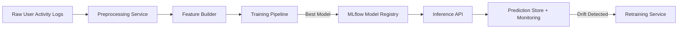

# 🎶 customer_churn
User Churn Prediction for Music Streaming Platforms

This project builds a **production-ready churn prediction pipeline** for a music streaming service.
It predicts whether a user is likely to stop using the platform based on their usage patterns, engagement signals, and subscription behavior.

---

## Problem Statement

Music streaming platforms suffer from **high churn** because switching costs for users are low.
A small drop in engagement (skipping sessions, not listening at night/weekends, shorter sessions) can be early signals of churn.

In this system, a user is considered **churned** if:

> **They have been inactive for 30 consecutive days after the cut-off date.**

This is a *future-labeling* strategy:
we only use data **before** the cut-off to build features, and then check **after** the cut-off to determine churn, ensuring no label leakage.

---

## Data Description

| Column Group | Example Features | Description |
|-------------|------------------|-------------|
| Demographics | `gender`, `region`, `device` | Static attributes about the user |
| Engagement | `freq_7d`, `freq_30d`, `recency_days` | How often and how recently they interacted |
| Consistency | `weekly_mean`, `weekly_std`, `activity_slope` | Trend + stability of engagement |
| Session-level | `avg_session_len_min`, `total_play_time_min` | Time spent on platform |
| Diversity | `unique_songs`, `unique_artists` | Variety of consumed content |
| Subscription | `current_level`, `time_as_paid_days` | Free vs paid transitions |
| Derived | `engagement_ratio`, `diversity_per_session` | Higher-level combined signals |

Churn is heavily class-imbalanced — only a small % of users actually churn —
and the model handles this using **class weighting / scale_pos_weight**.

---

## 🏗️ System Architecture (High-Level)

```text
Raw Logs → Preprocessing → Feature Engineering → Model Training → Serving → Monitoring → Retraining
```



## Model Performance (Initial)

| Metric | Value |
|--------|--------|
| ROC-AUC | ~0.97 |
| Accuracy | ~0.98 |
| F1-score (churn class) | High (class-balanced) |

---

## How to Run (Local)

### 1. Install dependencies
```bash
uv sync
```

### 2. Preprocess raw logs
```bash
uv run python src/preprocess/preprocess_service.py
```

### 3. Build features
```bash
uv run python src/features/build_features.py
```

### 4. Train the model
```bash
uv run python src/training/train_service.py
```

### 5. Serve inference API
```bash
uv run python src/api/app.py
```

## 🧠 Inference Examples

### CURL Example

```bash
curl -X POST http://localhost:8000/predict \
  -H "Content-Type: application/json" \
  -d '{
    "logs": [
      {
        "ts": "2025-01-10T12:32:00Z",
        "userId": "U123",
        "page": "NextSong",
        "song": "Song Name",
        "artist": "Artist Name",
        "device": "Mobile",
        ...
      }
    ]
  }'
  ```

  ### Example JSON Response
  ```bash
  {
  "userId": "U123",
  "churn_probability": 0.84,
  "churn_pred": 1,
  "model_version": "v2-prod",
  "inference_timestamp": "2025-10-13T15:23:01Z"
}
```

## Monitoring & Drift Detection

This system continuously evaluates whether the training data distribution is still representative of production behavior.

| Component        | Method Used                 |
|------------------|-----------------------------|
| Numeric drift     | `Kolmogorov–Smirnov` (KS)     |
| Categorical drift | `Population Stability Index` (PSI) |
| Backend storage   | SQLite (`predictions.db`) + Parquet snapshots |
| Monitoring window | Rolling 7 days (configurable) |
| Trigger threshold | KS > 0.2 OR PSI > 0.25       |
| Result            | Generates drift report CSV + `MLflow` artifact |

When drift is detected, the retrain_service is called, which:

- loads new data from the prediction store
- rebuilds features
- retrains the model
- compares with production
- promotes if better via `MLflow` registry

---

## Retraining Policy

Once drift is detected, or model performance drops, the system triggers retraining.

| Trigger Type       | Condition                         |
|--------------------|----------------------------------|
| Data drift       | PSI > 0.25 or KS > 0.2           |
| Performance drop | Current AUC < Production AUC      |
| Time-based        | Monthly refresh (optional)        |
| New behavior      | Enough new unseen user patterns   |

Retraining **reuses the entire feature engineering pipeline** to stay consistent across versions.

---

## Challenges & Solutions

| Challenge                     | Solution |
|------------------------------|---------|
| Data leakage risk            | Strict cutoff window before churn label |
| Imbalanced classes           | Balanced weights (`scale_pos_weight`) |
| Overfitting risk             | Feature selection + model comparison |
| Monitoring accuracy          | Storing raw + engineered features for drift |
| Serving consistency          | Save full pipeline, not just model object |

---

## Known Limitations & Future Work

| Area               | Limitation                              | Possible Improvement                 |
|--------------------|------------------------------------------|--------------------------------------|
| Cold-start users    | New users hard to classify               | Add demographic priors               |
| Only tabular model  | No deep sequential modeling              | Add RNN/transformer on user history |
| Offline monitoring  | Current drift is batch-based             | Add streaming monitoring             |
| No explainability   | Predictions are not justified to user   | Add SHAP/LIME in inference API      |
